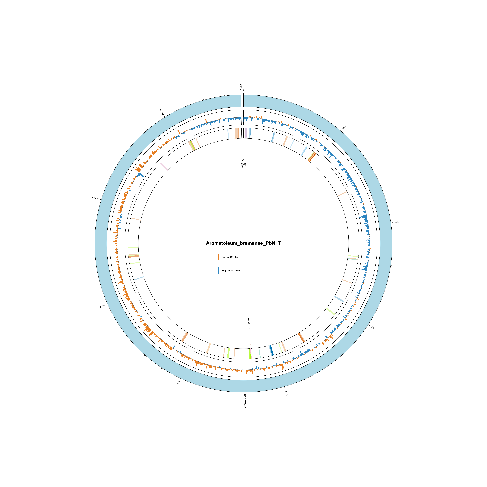

# BTEX-HMM: A database for the functional annotation of BTEX-degradation genes from isolate genomes and metagenomes

## Table of Contents
* [Installation](#installation)
* [Usage](#usage)
* [KEGG Pathway visualizations](#kEGG-Pathway-visualizations)
* [Circos plot visualizations](#Circos-plot-visualizations)

## Installation

This toolkit uses hmmscan from the HMMER suite to query BTEX-HMM profiles.
The following packages are needed for visualization and analysis:

- python 3.9 or newer
- pip
- Rscript
- hmmer 3.3 or newer
- prodigal
- kofamscan
- pandas 2.0 or newer
- numpy 1.24 or newer
- matplotlib 3.7 or newer
- biopython 1.81 or newer
- circos 0.69 or newer

If your system already satisfies these requirements, you can move directly to running the BTEX-HMM scripts. Otherwise, you may install everything through Conda as shown below.

1. Conda Install
Confirm that a working Conda installation is available. See [Conda installation](https://docs.conda.io/projects/conda/en/latest/user-guide/install/index.html) for more details.

<!-- ### Development install
Create the BTEX-HMM environment and install all dependencies plus an editable install of the local repo via *btex_env.yml*: -->

```bash
cd /path/to/BTEX-HMMs
conda env create -n btex-hmm -f btex_env.yml
```

Activate the environment:

```bash
conda activate btex-hmm
```

Confirm that the KOfamScan executable is installed:

```bash
command -v exec_annotation
```

KOfamScan should be available on the active conda environment PATH when the environment is set up correctly.

### Database download:

The KOfam HMM database can be installed for users interested in the broad metabolic or degradation potential of their genomes

```bash
mkdir /path/to/databases/kofam
cd /path/to/databases/kofam

wget https://www.genome.jp/ftp/db/kofam/ko_list.gz
wget https://www.genome.jp/ftp/db/kofam/profiles.tar.gz

gunzip ko_list.gz
tar -xzf profiles.tar.gz
```

Setting the environment variable:

```bash
# shell scripts placed in activate.d folder to run automatically when env is activated
mkdir -p $CONDA_PREFIX/etc/conda/activate.d

cat > $CONDA_PREFIX/etc/conda/activate.d/kofam.sh <<'EOF'
export KOFAM_DB=/path/to/databases/kofam
EOF
```

Confirm the database path and executable:
```bash
conda deactivate
conda activate btex-hmm
echo $KOFAM_DB
command -v exec_annotation
```

`KOFAM_DB` should point to the database directory containing `profiles/` and `ko_list`.

## Usage
To run BTEX-HMMs, input should be a directory containing either genome DNA FASTA files or protein FASTA files.

### Example with protein files in *test_genomes*
```bash
annotate-btex -g btexhmm/test_genomes \
              -o path/to/output_dir \
              --evalue 1e-5 \
              --cpus 8
```
> [!NOTE]
> For proper parsing of genomic coordinates, protein files produced from Prodigal are needed.

### Example with genome FASTA files
```bash
annotate-btex -g /path/to/genome_fastas \
              -o path/to/output_dir \
              --meta \
              --cpus 8
```

> [!NOTE]
> Use `--skip-kofam` to skip downloading and searching the KOfam database.
> For FASTA sequence inputs, the program will run gene-calling with Prodigal with either the `--meta` or `--single` flag specified as input. 

**Main outputs**

1. `btex_hmm_summary.csv`  
   Reports individual BTEX HMM hits, including the matched HMM, the threshold used, the hit score, and the protein sequence header for the corresponding gene.

2. `btex_hmm_summary_counts.csv`  
   Summarizes BTEX HMM hits by HMM, reporting hit counts instead of individual protein sequence headers.

3. `prodigal_output/`  
   Generated when genome DNA sequences are used as input. This directory contains one subdirectory per genome and contains:  
   ` {genome}_prodigal.gbk `  
   ` {genome}.faa `  
   ` {genome}_kofam_abv_thres.tsv `, produced when the KOfam step runs successfully for that sample.

4. `hmmscan_output/`  
   Contains one subdirectory per input file with raw `.domtblout` results generated before and after filtering by GA thresholds.

5. `log_file_annotate-btex.txt`  
   Records run progress as well as detailed warning and error messages.

## KEGG Pathway visualizations
BTEX-HMM supports visualization of hits to BTEX-HMM or KOfam on KEGG pathways.

**For visualization of BTEX-HMM hits on BTEX-associated KEGG pathways:**

```bash
vis-btex --hmmscan /path/to/output_dir/btex_hmm_summary.csv \
         -o /path/to/vis-btex-outputs
```

> [!Note]
> `vis-btex` takes the `prodigal_output` directory with `{genome}_kofam_abv_thres.tsv` per input genome instead of `btex_hmm_summary.csv` for visualizing all KOfam hits on an interested pathway.
> Using `-s {genome}` generates the visualization for hits specific to {genome}. The value of {genome} must exactly match the sample name in `btex_hmm_summary.csv`. 


 An example annotated pathway generated via the KEGG URL is available [here](https://www.kegg.jp/kegg-bin/show_pathway?map=map00642&multi_query=ko:K14748%20%23F08A8B,%23FF0000%0Ako:K14749%20%23F08A8B,%23FF0000%0Ako:K10700%20%23F08A8B,%23FF0000%20%23377EB8,%23FF0000%0Ako:K17048%20%23F08A8B,%23FF0000%20%23377EB8,%23FF0000%0Ako:K17049%20%23F08A8B,%23FF0000%20%23377EB8,%23FF0000%0Ako:K14579%20%23FFFFFF,%23FF0000%0Ako:K14580%20%23FFFFFF,%23FF0000
 ).

**For visualization of all KOfam hits on a KEGG pathway:**

```bash
vis-btex -g /path/to/prodigal_output \
         -o /path/to/vis-btex-outputs \
         --pathway 00623
```
> [!Note]
> vis-btex takes the `prodigal_output` directory with `{genome}_kofam_abv_thres.tsv` per input genome instead of `btex_hmm_summary.csv` for visualizing all KOfam hits on an interested pathway.

**Outputs:**
1. {output_dir}/`KEGG_MAP_LINKS.txt` 
   Contains the URLs for visualizing hits on KEGG pathways. 
   
   By default, these links correspond to the following KEGG pathways:
    - `map00642` xylene degradation
    - `map00623` toluene degradation
    - `map00622` ethylbenzene degradation
    - `map00362` benzoate degradation
   
   To visualize additional pathways, run `annotate-btex` with the KOfam step enabled so that KEGG pathway information is available. This allows visualization of other pathways such as `map00626` for naphthalene degradation.


2. {output_dir}/`sample_color_legend.tsv` 
   Contains the color assigned to each input genome for KEGG pathway visualization.


## Circos plot visualizations


**BTEX-HMM hits:**
```bash
run-circos \
  --hmmscan /path/to/btex_hmm_summary.csv \
  --dna /test_genomes/Aromatoleum_bremense_PbN1T.fna \
  -o /path/to/output_dir \
  -s "Aromatoleum_bremense_PbN1T" \
  --window-size 5000
```

**KOfam and BTEX-HMM hits:**

```bash
  run-circos \
  --hmmscan /path/to/btex_hmm_summary.csv \
  --dna /path/to/genome.fna \
  -o /path/to/outdir \
  -s sample_name \
  --window-size 5000 \
  --prodigal-gbk /path/to/sample_prodigal.gbk \
  --kofam-output /path/to/kofam_abv_thres.tsv 
```
> [!Note]
> run-circos takes `--prodigal-gbk` which specifies the prodigal genbank file for parsing genomic coordinates of genes and `--kofam-output` which contain all hits to KOfam HMM database. 

**Input:**
- `run-circos` takes `btex_hmm_summary.csv` together with the genome sequence file for a single sample. In the example above, the genome sequence file for Aromatoleum bremense PbN1T in the test_genomes folder is used.
- `--window-size` can be use to adjust the window size used to calculate GC-skew for better visualization.
- Provide a sample name with `-s` that exactly matches the sample name in btex_hmm_summary.csv.

**Output**

1. `{output_dir}/circos_plot.pdf`  
   Main visualization showing the genome track, GC skew track, and genomic distribution of BTEX-HMM hits. Optionally includes a KOfam track displaying hits to xenobiotic degradation pathways on KEGG.

2. `{output_dir}/kofam_density_track_windows.tsv`  
   Table of pathway density values across genomic windows for xenobiotic degradation pathways.

3. `{output_dir}/btex_hmm_hits.gbk`  
   GenBank formatted file listing genes identified as BTEX-HMM hits.

4. `{output_dir}/kofam_category_hits.tsv`  
   Table of all KOfam hits with their corresponding KO identifiers.

5. `gene_hits.tsv`, `karyotype.tsv`, `hmm_colors.tsv`, `contig_length.tsv`  
   Configuration files used to generate the Circos plot.
   

**Example output using the Aromatoleum bremense PbN1T genome:**
<p align="center">
  
</p>

